# 👋 Hey there, I'm Sean Sun

> Software Engineer | AI Enthusiast | OpenClaw User

---

## 📊 GitHub Stats

  
  

---

## 🌍 Open Source Contributions

<!-- contributions:start -->
**11** merged pull requests across **5** repositories.

| Repository | ⭐ | Merged pull requests |
| --- | ---: | --- |
| [openclaw/openclaw](https://github.com/openclaw/openclaw) | 390.3k | [#68389](https://github.com/openclaw/openclaw/pull/68389) plugins: clarify allowlist warning when entries don't match discovered ids [#68430](https://github.com/openclaw/openclaw/pull/68430) extensions/acpx: expose probeAgent config so non-codex ACP stacks stay available [#54940](https://github.com/openclaw/openclaw/pull/54940) fix: normalize openai-completions usage fields for DashScope and compatible providers |
| [langgenius/dify](https://github.com/langgenius/dify) | 156.9k | [#42248](https://github.com/langgenius/dify/pull/42248) refactor(api): pass session explicitly into RBACResourceService (#37403) [#33750](https://github.com/langgenius/dify/pull/33750) fix: use RetrievalModel type for retrieval_model field in HitTestingPayload [#12273](https://github.com/langgenius/dify/pull/12273) fix: DocumentAddByFileApi miss data_source_type field but there is a mandatory value check |
| [farion1231/cc-switch](https://github.com/farion1231/cc-switch) | 135.2k | [#7348](https://github.com/farion1231/cc-switch/pull/7348) fix(misc): ignore shell startup output when probing tool versions in WSL [#7346](https://github.com/farion1231/cc-switch/pull/7346) fix(misc): fetch npm dist-tags from the dedicated endpoint with the probe timeout |
| [binarywang/WxJava](https://github.com/binarywang/WxJava) | 33.1k | [#3926](https://github.com/binarywang/WxJava/pull/3926) feat(cp): complete WeDoc OA APIs and align form share/statistic compatibility [#3339](https://github.com/binarywang/WxJava/pull/3339) 增加临时素材上传重载 |
| [gpustack/gguf-parser-go](https://github.com/gpustack/gguf-parser-go) | 304 | [#29](https://github.com/gpustack/gguf-parser-go/pull/29) fix: derive hybrid attention interleaving from `<arch>.full_attention_interval` |
<!-- contributions:end -->

The stats cards and this table are refreshed daily by <a href=".github/workflows/update-profile.yml">a workflow</a> in this repository.

---

## 💼 What I'm working on

- 🐭 **Spring Boot 4 Migration** - Migrating legacy apps
- 🤖 **AI & LLMs** - OpenClaw, Dify, and AI automation
- 📚 **Learning** - Japanese (新标准日本语)

---

## 🛠️ Tech Stack

---

## 📫 Connect

